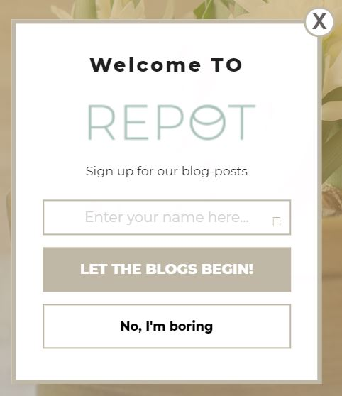

# Newsletter plugin for Repot
With this plugin you will be able to make a pop-up on your page where users can sign up for newsletters

***
## If you want to download the plugin follow these steps:
* Download the repository **wordpress-partyvibesplugin-main**
* Unzip the file
* Rename your folder from **wordpress-partyvibesplugin-main** to **partyvibesplugin**
* Copy the folder and insert into your wordpress root-directory --> wp-content --> **plugins**
* Activate the plugin in Wordpress
* Insert shortcode **[show_partyvibesplugin]**
* Visit your page and your plugin will appear. 

